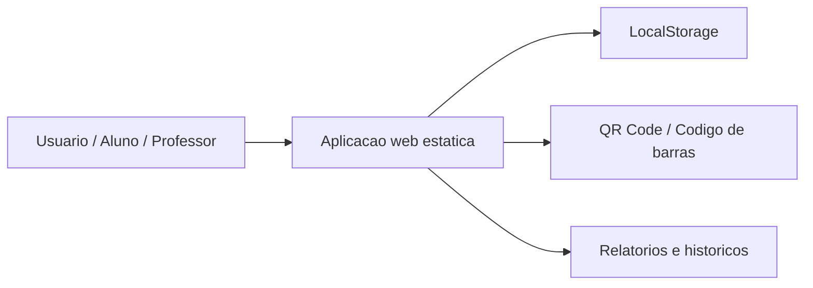

# LogiCode Academy

Plataforma educacional para simular rotinas logisticas, WMS, rastreabilidade, leitura de codigos e acompanhamento de atividades.

## Visao Geral

O projeto apresenta uma aplicacao web estatica voltada a aprendizado e demonstracao de processos logisticos. Pelo conteudo do repositorio, a solucao organiza telas para recebimento, conferencia, estoque, movimentacao, saida, inventario, pedidos, docas, transportadoras, atividades, ranking, certificados e relatorios.

## Problema Resolvido

Estudantes, professores e equipes em treinamento precisam visualizar fluxos logisticos de forma pratica. A aplicacao cria um ambiente demonstrativo para entender como produtos, codigos, movimentacoes e historicos se conectam dentro de uma operacao.

## Beneficios

- Facilita a apresentacao didatica de processos logisticos.
- Simula rotinas de WMS sem depender de infraestrutura complexa.
- Apoia aulas, treinamentos e demonstracoes de TCC.
- Usa QR Code e codigo de barras para reforcar conceitos de rastreabilidade.
- Permite explorar historico, relatorios e atividades em uma interface unica.

## Principais Funcionalidades

### Funcionalidades Disponiveis

- Home institucional e apresentacao do projeto.
- Login e perfis por setor.
- Dashboard logistico.
- Cadastro e consulta de produtos.
- Recebimento, conferencia, movimentacao, saida e inventario.
- Pedidos, picking, docas e transportadoras.
- Leitura de QR Code e codigo de barras.
- Historico geral e historico por produto.
- Atividades, missoes, pontuacao e ranking.
- Certificados.
- Relatorios com exportacao simulada.
- Persistencia local no navegador.

### Funcionalidades Planejadas

- Conexao com banco de dados real e API de autenticacao aparecem como evolucao recomendada no conteudo do projeto.

## Como Funciona

```text
Usuario acessa a aplicacao
-> escolhe perfil ou setor
-> cadastra ou consulta produtos
-> simula recebimento, conferencia, estoque e saida
-> usa codigos para rastreabilidade
-> historicos, atividades e relatorios consolidam o aprendizado
```

## Tecnologias Utilizadas

- JavaScript
- HTML
- CSS
- Node.js
- LocalStorage
- BarcodeDetector API

## Arquitetura



## Estrutura Do Projeto

- `index.html`: entrada da aplicacao.
- `styles.css`: estilos e layout responsivo.
- `app.js`: telas, dados demonstrativos e interacoes.
- `config.js`: configuracao inicial.
- `assets/`: imagens e materiais visuais.
- `serve-local.js`: servidor local em Node.js.
- `DEPLOY.md`: orientacoes de hospedagem existentes.

## Status

Prototipo educacional em desenvolvimento/manutencao. O projeto e adequado para demonstracao de conceitos logisticos, mas exige revisao de seguranca antes de uso publico amplo.

## Minha Participacao

Desenvolvimento e organizacao de uma experiencia educacional para demonstrar fluxos logisticos, rastreabilidade, leitura de codigos, historicos e atividades em ambiente web.

## Autor

Desenvolvido por Alexandre Santana dos Santos — Kalion Tecnologia
